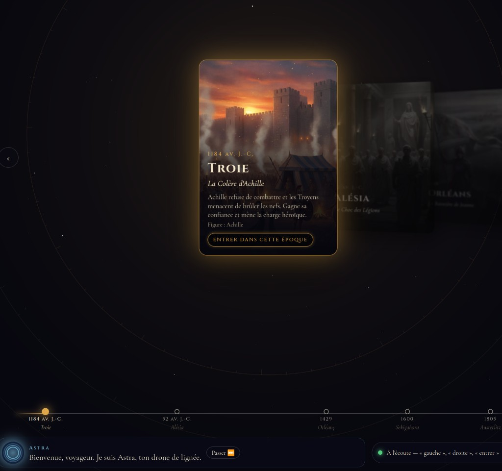
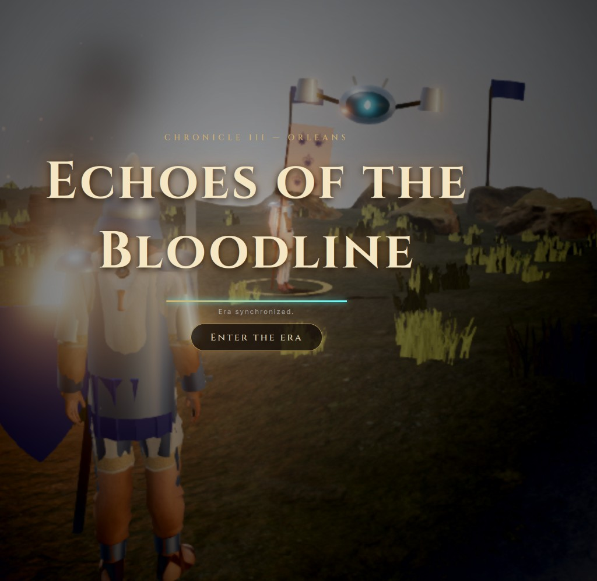
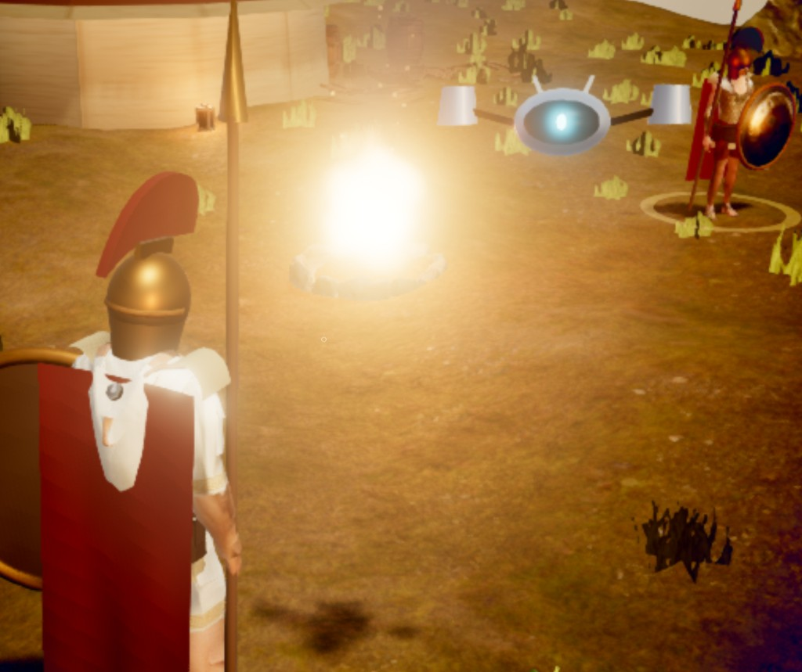

# Echoes of the Bloodline

A short time-travel skirmish in the browser. Astra, a drone companion, walks you through five battles. The interface and the voices are in English.

**Play it:** [echoes-bloodline.chronicle-game.workers.dev](https://echoes-bloodline.chronicle-game.workers.dev)

## How a run works

1. **Pick an era** on the timeline. Astra introduces the conflict. Scroll, use the arrow keys, or say “left”, “right”, and “enter”.
2. **Step through the rift.** The era loads with its own ground, clothes, and leader.
3. **Speak once.** Press E and talk to that leader. Astra tells the story. One exchange is enough: the fight starts right after.
4. **Fight.** You stand with your troops. Kill two or three enemies. Astra calls out threats while you move, dodge, and strike. Points and combos tick up as people fall.
5. **Jump forward.** When the skirmish ends, Astra explains what happened and opens the temporal rift to the next era. Home brings you back to the timeline.

The five stops, in order: Troy (1184 BCE), Alesia (52 BCE), Orleans (1429), Sekigahara (1600), Austerlitz (1805).







## Controls

| Action | Desktop | Notes |
| --- | --- | --- |
| Move | WASD or arrows | Shift to run |
| Camera | Hold a mouse button and drag | Releasing the button stops the camera |
| Attack | Left click | |
| Dodge | Space | |
| Talk to the leader | E | Once, then the battle starts |
| Talk to Astra | T | |
| Close the dialogue | Esc | |
| Back to the timeline | Home | Top-left during a battle |

On a phone, the same actions are on-screen buttons.

## Run it yourself

Node.js 20+. Put the keys in a `.env` file at the repo root (this file stays local and is not committed):

```
GOOGLE_API_KEY=...
GRADIUM_API_KEY=...
```

```bash
npm install
npm run dev
```

Open http://localhost:5173. The Vite dev server proxies voice and Gemini to the Node server on port 8787.

Without those keys the game still runs: scripted replies replace Gemini, and lines stay on screen as subtitles.

## Put it on itch.io

```bash
npm run package:itch
```

That writes `echoes-of-the-bloodline-itch.zip` (about 52 MB). On itch.io, create an HTML project, check “This file will be played in the browser”, set the viewport to 960×600, and upload the zip. `index.html` is at the root of the archive. The itch build talks to the hosted server, so Gradium and Gemini keep working. Do not put `.env` in the zip.

## Where things live

- `client/index.html` and `client/src/home/` — the timeline and Astra’s intro.
- `client/troy.html` and `client/src/main.ts` — every era is this one scene, chosen with `?era=`.
- `client/src/eras.ts` — story, outfits, and objectives for each era.
- `client/src/battle.ts` — the skirmish.
- `server/` — local Express server: Gemini in `brain.ts`, Gradium voice in `gradium.ts`.
- `worker/` — the same sockets on Cloudflare, which is what the public URL and the itch build use.
